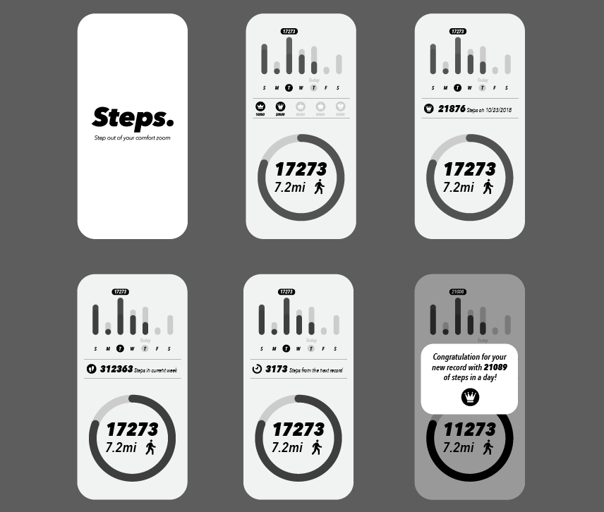

# 

## Version  -- 2.0
Refactored extensive portions of the codebase from class components into react hooks.

## Why Create
Too many pedometer app with ads...
Just want to make myself without annoying content.

## Description
A mobile app created to help people record their daily steps using MERN stack.

## Deploy link
https://expo.io/@iconick2020/steps

## Demo App

## Interface Sample

## Key Featrues
(1). Instant view of your steps data 
(2). Analize & display your data in multiple charts 
(3). A medal reward once you hit the designated steps 
